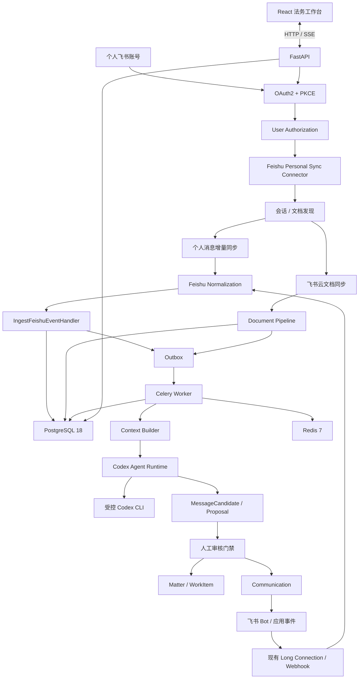

# 飞书个人账号消息与云文档同步设计

**日期：** 2026-08-08  
**状态：** 已批准，待实施  
**仓库：** `aw9923299-alt/legal-workbench`  
**基线：** `main@48f987e`（PR #5 合并后）

## 1. 目标

在不破坏现有法务工作台架构的前提下，增加“个人飞书账号授权”，让系统读取该用户经飞书官方 API 授权后可访问的消息和云文档，并继续进入现有：

```text
FeishuMessage
→ ContextSnapshot
→ AgentRun
→ MessageCandidate
→ 人工确认
→ LegalMatter / MatterUpdateProposal
→ WorkItem
```

本次不采用飞书桌面客户端抓包、本地数据库解析、UI 自动化、Hook 等非官方方式。

## 2. 核心方案：双身份 Feishu Integration

保留现有 App/Bot 身份，同时新增 User 身份：

```text
                         ┌─ App Identity
Feishu Integration ──────┤  tenant_access_token
                         │
                         └─ User Identity
                            user_access_token
                                  ↓
                         Unified Ingestion
                                  ↓
                            Application
                                  ↓
                       PostgreSQL + Outbox
                                  ↓
                            Codex Agent
```

### 2.1 App Identity 继续负责

- 官方 Long Connection / Webhook；
- 机器人可见消息；
- 当前已支持的消息资源下载；
- 审核后受控 Communication 外发。

### 2.2 User Identity 新增负责

- OAuth 授权；
- 用户可访问的 P2P / 群聊历史消息；
- 用户可访问的飞书云文档；
- 消息和文档的增量补偿同步。

### 2.3 不可破坏的边界

1. User Token 不进入 Codex、前端、Redis、日志或业务正文表。
2. Codex 不直接调用飞书 API。
3. User API 返回的消息不直接写核心消息表，必须进入统一 Ingestion。
4. PostgreSQL 继续作为唯一业务事实库。
5. 首期个人身份只读，不启用 `im:message.send_as_user`。
6. 外发仍经过 ReviewPackage → 人工审核 → Communication。

## 3. 现有代码可直接复用

当前仓库已经具备：

- `integrations/feishu_connector.py`：独立飞书连接进程；
- `integrations/feishu_sdk.py`：官方 SDK Long Connection；
- `integrations/feishu_client.py`：REST Client、历史消息、附件下载、发送；
- `integrations/feishu_events.py`：消息标准化；
- `application/feishu_handlers.py`：事件/消息幂等、版本、附件、Outbox；
- `application/feishu_operations.py`：连接状态、补偿同步、附件下载；
- `application/feishu_scopes.py`：群聊授权范围；
- `infrastructure/secrets.py`：本地 Secret 安全存储；
- `message_attachments → document_versions → document_extractions → document_segments`；
- Outbox + Celery + Redis；
- ContextSnapshot + CodexCliRuntime；
- Candidate → Matter / WorkItem 人工确认闭环。

所以本次新增重点是：

```text
个人 OAuth
+ User Token 生命周期
+ Personal Sync Connector
+ 会话发现 / Checkpoint
+ Feishu Native Document Connector
+ 分级消息分析策略
```

## 4. 飞书官方能力边界

### 4.1 User Token

采用标准 OAuth Authorization Code + PKCE S256：

```text
Authorization Code
+ state
+ PKCE
+ user_access_token
+ offline_access
+ refresh_token
```

`offline_access` 用于长期后台同步。

### 4.2 消息读取

飞书“获取会话历史消息”支持 `user_access_token`，`container_id_type=chat` 同时覆盖 P2P 与群聊。

用户身份读取至少需要：

```text
im:message 或 im:message:readonly

P2P：
im:message.p2p_msg:get_as_user

群聊：
im:message.group_msg:get_as_user
```

因此设计确认支持：

```text
已知 chat_id 的 P2P 历史消息读取
已知 chat_id 的群聊历史消息读取
```

但是否存在稳定官方 API 一次性枚举“当前用户全部 P2P 会话”，必须通过 Phase 0 真实 PoC 验证。若官方能力不能完整枚举，则采用“已知 P2P + 后续持续发现”的渐进式索引，不用客户端抓取补洞。

### 4.3 Refresh Token Rotation

飞书 Refresh Token 仅能使用一次。刷新成功会返回新的 Refresh Token，旧值立即失效。

因此 Token 刷新必须串行化，并在成功后原子替换 Access Token 与 Refresh Token。

### 4.4 云文档

飞书支持 `user_access_token`：

- 搜索当前用户可见云文档；
- 按用户权限读取文档；
- 新版文档可直接获取 Markdown 正文；
- 可按文件夹列举文件。

### 4.5 消息附件

当前“获取消息中的资源文件”接口要求机器人与消息处于同一会话，且官方能力明显以 Bot/App 场景为主。

因此个人消息附件不得在设计阶段承诺全部可下载。Phase 0 必须验证：

```text
User Token 能读消息正文时
该消息附件是否也能通过官方 API 获取
```

若不能：

```text
保存附件元数据
→ resource_unavailable_under_user_identity
→ 工作台显示正文不可用
```

不得引入客户端缓存扫描、SQLite 破解或 UI 自动化。

## 5. 目标架构



## 6. Control Plane / Data Plane

### FastAPI：Control Plane

只负责：

- OAuth 发起与回调；
- 授权状态；
- 会话范围配置；
- 文档导入/订阅配置；
- 人工触发同步；
- 查询、审核和诊断。

### `feishu-user-sync`：Data Plane

独立长期运行进程负责：

- Token 刷新；
- 会话发现；
- 消息增量同步；
- 文档同步；
- Checkpoint；
- 限流和重试。

不得让 FastAPI 请求线程长期轮询飞书。

## 7. OAuth 与授权模型

新增：

```text
integrations/
    feishu_oauth.py
    feishu_user_client.py
    feishu_user_sync.py
```

OAuth 流程：

```text
工作台点击「连接我的飞书」
↓
POST /api/v1/integrations/feishu-user/authorize
↓
生成 state + code_verifier + code_challenge
↓
浏览器跳转飞书授权
↓
GET /api/v1/integrations/feishu-user/callback
↓
code + verifier → user_access_token
↓
读取用户标识
↓
保存 Authorization 元数据与 Secret 引用
```

首期只申请实际需要的只读权限；云文档 Scope 在 Phase 0 根据真实 API 返回进一步收敛。

## 8. Token 数据模型与安全

新增：

```text
feishu_user_authorizations
```

建议字段：

```text
id
user_open_id
tenant_key
granted_scopes
access_token_ref
refresh_token_ref
access_expires_at
refresh_expires_at
token_version
status
last_refresh_at
last_error_code
last_error_message
created_at
updated_at
revoked_at
```

真实 Token 不写 PostgreSQL，继续使用现有 `LocalSecretProvider`：

```text
data/local-secrets/
    feishu_user_access_<authorization-id>.secret
    feishu_user_refresh_<authorization-id>.secret
```

要求：

- Secret 目录 `0700`；
- Secret 文件 `0600`；
- 原子替换；
- API 永不返回 Token；
- 前端不持久化 Token；
- Codex Worker 无权读取 Token 文件。

### 8.1 Refresh 锁

刷新必须实现类似：

```text
BEGIN
SELECT authorization FOR UPDATE
再次检查是否需要刷新
读取当前 refresh_token
调用飞书 token endpoint
原子替换 access_token + refresh_token
更新 expires_at + token_version
COMMIT
```

外部 HTTP 调用不应长期占数据库事务；实际实现可使用短事务 claim/lease + 单次刷新 owner，保证同一 Authorization 同时只有一个刷新者。

## 9. User API Client

现有 `FeishuApiClient` 目前以内置 tenant token 为主。改造为身份可注入：

```text
FeishuApiClient
    ├─ TenantTokenProvider
    └─ UserTokenProvider
```

上层调用显式声明身份，不允许 Client 自己猜测。

建议接口：

```python
list_chat_messages(identity, chat_id, start_time, end_time)
get_message(identity, message_id)
search_documents(user_identity, query)
get_document_markdown(user_identity, token)
list_folder_files(user_identity, folder_token)
```

## 10. 个人消息同步

### 10.1 不新增第二套 Message 模型

User API 返回消息后必须：

```text
User API
→ UserMessageAdapter
→ 标准内部 Feishu Envelope
→ IngestFeishuEventHandler
```

禁止：

```text
User API → 直接 INSERT feishu_messages
```

这样才能继续复用：

- event/message 幂等；
- 编辑/撤回版本；
- 附件；
- Outbox；
- 审计；
- ContextSnapshot。

### 10.2 内部事件 ID

历史同步没有事件推送 ID 时，生成稳定内部 ID：

```text
uat:{tenant_key}:{message_id}:{update_time-or-create_time}
```

并增加：

```text
source = user_history_sync
```

数据库最终仍以外部 `message_id` 作为消息去重核心之一。

### 10.3 Checkpoint

新增：

```text
feishu_sync_checkpoints
```

字段：

```text
authorization_id
scope_id
chat_id
last_message_time
last_message_id
last_success_at
last_attempt_at
coverage_status
last_error_code
version
```

增量策略：

```text
watermark - overlap window
→ 分页 ASC 拉取
→ Normalize
→ Ingest
→ 成功后推进 checkpoint
```

默认 overlap 建议 5 分钟，由 PostgreSQL 幂等吸收重复，优先保证 Mac 睡眠、断网和 Worker 重启后的恢复完整性。

## 11. 会话发现与 Scope

现有 `IntegrationScope` 继续作为授权范围事实源。

新增 Scope 类型：

```text
p2p
group
```

### 群聊

```text
User Token 自动发现用户所在群
→ 写入 IntegrationScope
→ 默认 unapproved
→ 用户在工作台 Allow / Exclude / Pause
```

### P2P

优先通过官方能力发现；若无法完整枚举：

```text
已知 P2P chat_id
+ 后续从消息/链接/手工登记持续发现
```

P2P 默认不能无边界全量回溯。首次启用时由用户选择回溯窗口，例如 7/30/90 天。

## 12. 消息采集与 AI 分析必须解耦

个人账号接入后消息量会明显增加，因此不能继续使用：

```text
supported message → should_trigger_analysis = true
```

改为：

```text
采集
→ PostgreSQL
→ MessageAnalysisPolicy
→ 需要时才 Outbox → Codex
```

第一版确定性策略：

```text
P2P 新消息                  → analyze
@本人 / 回复本人             → analyze
指定高价值法务群             → analyze
明确任务/期限关键词           → analyze
普通群消息                   → store_only
寒暄/表情/系统通知            → store_only
```

AI 可以判断“是否构成法务事项”，但不能决定自己扩大数据采集范围。

## 13. 飞书原生文档 Connector

原生飞书文档不要硬塞成 MessageAttachment。

新增：

```text
FeishuDocumentConnector
```

支持三个入口：

### 13.1 消息关联文档

```text
消息包含飞书文档链接
→ 解析 token/type
→ User Token 获取 Markdown
→ DocumentVersion / Segment
→ 与消息建立来源关系
→ ContextSnapshot 可按权限引用
```

这是首期最高优先级。

### 13.2 指定文件夹订阅

用户可选择法务相关文件夹进行递归同步。

不得默认镜像全部云空间。

### 13.3 手动搜索导入

工作台提供“搜索我的飞书文档”：

```text
关键词
→ 飞书 Search API
→ 用户选择
→ Import
```

## 14. 文档数据模型

新增：

```text
feishu_documents
feishu_document_versions
feishu_document_subscriptions
```

`feishu_documents`：

```text
id
authorization_id
document_token
document_type
title
owner_id
source_type
source_chat_id
source_message_id
remote_modified_at
access_status
sync_status
last_error_code
created_at
updated_at
```

`feishu_document_versions`：

```text
id
document_id
version
remote_modified_at
content_hash
markdown
fetched_at
```

之后复用现有 `document_segments` / Context 限界逻辑。

## 15. 附件访问策略

把现有单一路径升级为：

```text
MessageResourceAccessStrategy
```

### `APP_VISIBLE`

现有 `tenant_access_token` 可下载，继续当前链路。

### `USER_VISIBLE_NATIVE`

仅当 Phase 0 真实验证确认官方 API 支持时启用。

### `METADATA_ONLY`

官方 API 无法读取：

```text
保存 file_key / file_name / mime / size
→ download_status = not_available
→ resource_unavailable_under_user_identity
```

不得以非官方客户端方式绕过。

## 16. API 设计

新增：

```text
/api/v1/integrations/feishu-user
```

建议接口：

```http
GET  /status
POST /authorize
GET  /callback
POST /revoke

POST /discover
POST /sync
GET  /chats
PATCH /chats/:scopeId

POST /documents/search
POST /documents/:token/import
POST /folders/:token/subscribe
DELETE /folders/:token/subscribe
```

所有写操作继续要求：

```text
Actor
Idempotency-Key
Correlation ID
版本条件
AuditEvent
```

## 17. React 页面

将当前 `/settings/feishu-scopes` 从“手工 chat_id 页面”升级为正常数据源管理页。

建议四个区域：

```text
[个人账号]
已授权用户 / 权限 / Token 状态 / 重新授权

[会话]
P2P / 群聊 / 同步范围 / 回溯窗口 / 最近同步

[云文档]
消息关联文档 / 文件夹订阅 / 搜索导入

[同步状态]
延迟 / Checkpoint / 权限错误 / 附件不可用 / 重试
```

手工输入 `chat_id` 保留在“高级设置”，不再作为主流程。

## 18. 状态模型

Authorization：

```text
connected
refreshing
reauth_required
permission_missing
revoked
expired
degraded
```

Sync Target：

```text
healthy
partial
permission_denied
unsupported
paused
failed
```

单个群或单个文档权限失败不得导致整个 Connector 崩溃。

## 19. 安全与隐私

1. 只通过飞书官方 API 和明确 User OAuth 授权读取数据。
2. 默认最小权限。
3. 新发现群聊默认 `unapproved`。
4. 不默认全盘同步飞书云文档。
5. P2P 首次回溯窗口必须可控。
6. 原始消息与文档仍按“不可信业务输入”处理。
7. Codex 只能获得经过 Context Builder 限界的文本和引用。
8. 不将 User Token 提供给 Codex Runtime。
9. 不自动以用户身份外发。
10. 保留完整授权、同步、读取、审核和外发审计。

## 20. Phase 0：真实 Feishu Capability Spike

正式实现前先完成以下真实账号验证：

| 验证项 | 成功标准 |
|---|---|
| OAuth + PKCE | localhost 完成授权并获得 UAT |
| Refresh | 使用 `offline_access` 成功刷新并正确轮换 Refresh Token |
| User identity | 能稳定绑定 open_id / tenant |
| 已知 P2P | UAT 能读取指定 P2P chat 历史 |
| 已知群聊 | UAT 能读取指定群历史 |
| 群发现 | 能列举本人所在群，或明确官方覆盖边界 |
| P2P 发现 | 明确能否自动枚举全部 P2P；不能则记录官方缺口 |
| 未读状态 | 拉取历史不改变个人客户端未读状态，人工验收 |
| 个人消息附件 | 明确是否存在官方可用读取路径 |
| 文档搜索 | 能搜索当前用户可见云文档 |
| 文档正文 | 能获取新版文档 Markdown |

Phase 0 的结论必须落入测试记录；对于未验证能力不得在 UI 或文档中标记为“支持”。

## 21. 实施顺序

### Phase 0 — Capability Spike

只验证官方能力，不扩展业务代码。

### Phase 1 — User Authorization

- OAuth + PKCE；
- UserTokenProvider；
- SecretProvider；
- Refresh rotation；
- Authorization 状态。

### Phase 2 — Personal Message Sync

- User Client；
- 已知 chat 历史读取；
- Unified Ingestion Adapter；
- Checkpoint / overlap；
- 补偿与恢复。

### Phase 3 — Discovery & Scope

- 群聊发现；
- P2P 能力按 Spike 结果实现；
- Scope 类型扩展；
- UI 数据源管理。

### Phase 4 — Native Documents

- 文档链接识别；
- 搜索/导入；
- 文件夹订阅；
- Markdown → Segment。

### Phase 5 — Analysis Policy

- 采集和分析解耦；
- 确定性 MessageAnalysisPolicy；
- 只为高价值消息创建分析 Outbox。

### Phase 6 — Long-running Acceptance

验证：

- Mac 睡眠/唤醒；
- Token 自动刷新；
- 断网重连；
- 429 限流；
- 权限撤回；
- Refresh Token 过期；
- Redis flush 后恢复；
- PostgreSQL 重启；
- 文档权限变化；
- 单 Scope 故障隔离。

## 22. 预计代码位置

后端：

```text
apps/backend/src/legal_workbench/
├─ integrations/
│  ├─ feishu_client.py
│  ├─ feishu_oauth.py                 # new
│  ├─ feishu_user_client.py           # new
│  └─ feishu_user_sync.py             # new
├─ application/
│  ├─ feishu_user_authorization.py    # new
│  ├─ feishu_personal_sync.py         # new
│  ├─ feishu_documents.py             # new
│  ├─ feishu_scopes.py
│  └─ feishu_handlers.py
├─ domain/
│  ├─ entities.py
│  └─ enums.py
├─ infrastructure/
│  ├─ models/
│  ├─ repositories.py
│  └─ secrets.py
├─ workers/tasks.py
└─ api/routes/
   ├─ feishu_user.py                  # new
   └─ feishu_documents.py             # new
```

前端：

```text
apps/web/src/pages/
├─ SetupPage.tsx
├─ FeishuScopesPage.tsx
├─ FeishuIntegrationPage.tsx          # new
└─ FeishuDocumentsPage.tsx            # optional / later
```

迁移建议从当前 `20260803_0012` 继续：

```text
20260808_0013_add_feishu_user_authorizations.py
20260808_0014_add_feishu_sync_checkpoints.py
20260808_0015_add_feishu_documents.py
```

实际迁移可按实现切片调整，但禁止把多个无关阶段塞入单个超大迁移。

## 23. 验收标准

最终至少满足：

1. 用户可在本地工作台完成飞书 OAuth 授权和撤销。
2. Token 可安全持久化并自动刷新，Refresh Token 并发刷新安全。
3. 已授权 P2P / 群历史消息可按用户权限同步进入现有 `FeishuMessage` 闭环。
4. 重复同步不会创建重复 Message、Outbox 或 Candidate。
5. Mac 睡眠/断网后可从 Checkpoint 补偿。
6. 新发现 Scope 默认不自动扩大采集权限。
7. 消息采集与 Codex 分析分离，普通群消息不会全部触发模型。
8. 用户可搜索/导入飞书云文档，新版文档以 Markdown 进入受控 Document Pipeline。
9. 个人消息附件能力如不受官方 API 支持，必须安全降级而非绕过。
10. Codex 无法获得飞书 User Token 或直接调用飞书。
11. 所有正式外发仍需人工审核。
12. 自动测试、迁移往返、真实飞书验收结果和未覆盖边界均有明确记录。

## 24. 非目标

本轮明确不做：

- 模拟个人飞书客户端；
- 读取飞书本地缓存数据库；
- 全公司/全租户消息抓取；
- 默认同步用户全部云文档；
- 自动将所有消息发送给 Codex；
- 个人身份自动回复；
- 绕过飞书权限获取附件；
- 自动创建正式 Matter；
- 取消现有人工审核门禁。

## 25. 官方参考

- 获取会话历史消息：<https://open.feishu.cn/document/server-docs/im-v1/message/list?lang=zh-CN>
- API 权限列表：<https://open.feishu.cn/document/server-docs/application-scope/scope-list?lang=zh-CN>
- 刷新 user_access_token：<https://open.feishu.cn/document/authentication-management/access-token/refresh-user-access-token?lang=zh-CN>
- 搜索云文档：<https://open.feishu.cn/document/server-docs/docs/drive-v1/search/document-search?lang=zh-CN>
- 获取云文档 Markdown：<https://open.feishu.cn/document/docs/docs-v1/get?lang=zh-CN>
- 获取消息中的资源文件：<https://open.feishu.cn/document/server-docs/im-v1/message/get-2?lang=zh-CN>
